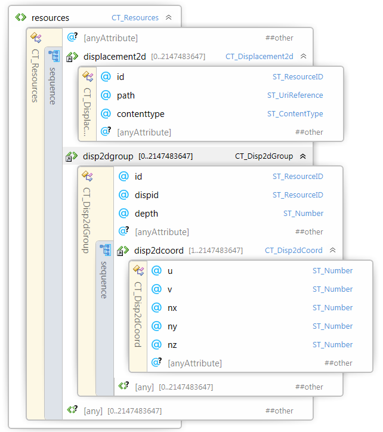

#
# 3MF Displacement Extension

## Specification & Reference Guide


| **Version** | 0.3 |
| --- | --- |
| **Status** | Draft |

## Table of Contents

- [Preface](#preface)
  * [About this Specification](#11-about-this-specification)
  * [Document Conventions](#12-document-conventions)
  * [Language Notes](#13-language-notes)
  * [Software Conformance](#14-software-conformance)
- [Part I: 3MF Documents](#part-i-3mf-documents)
  * [Chapter 1. Overview of Additions](#chapter-1-overview-of-additions)
  * [Chapter 2. Resources](#chapter-2-resources)
    + [2.1 Displacement2D](#21-displacement2d)
    + [2.2 Disp2DGroup](#22-disp2dgroup)
      - [2.2.1 Disp2DCoords](#221-disp2dcoords)
  * [Chapter 3. Usage rules and interpretation](#chapter-3-usage-rules-and-interpretation)
- [Part II. Appendixes](#part-ii-appendixes)
  * [Appendix A. Glossary](#appendix-a-glossary)
  * [Appendix B. 3MF XSD Schema](#appendix-b-3mf-xsd-schema)
  * [Appendix C. Standard Namespace](#appendix-c-standard-namespace)
  * [Appendix D: Example file](#appendix-d-example-file)
- [References](#references)


# Preface

## 1.1. About this Specification

This 3MF displacement specification is an extension to the core 3MF specification. This document cannot stand alone and only applies as an addendum to the core 3MF specification. Usage of this and any other 3MF extensions follow an a la carte model, defined in the core 3MF specification.

Part I, "3MF Documents," presents the details of the primarily XML-based 3MF Document format. This section describes the XML markup that defines the composition of 3D documents and the appearance of each model within the document.

Part II, "Appendixes," contains additional technical details and schemas too extensive to include in the main body of the text as well as convenient reference information.

The information contained in this specification is subject to change. Every effort has been made to ensure its accuracy at the time of publication.

This extension MUST be used only with Core specification 1.x.

## 1.2. Document Conventions

See [the 3MF Core Specification conventions](https://github.com/3MFConsortium/spec_core/blob/master/3MF%20Core%20Specification.md#document-conventions).

In this extension specification, as an example, the prefix "d" maps to the xml-namespace "http://schemas.microsoft.com/3dmanufacturing/displacement/2018/05". See [Appendix C. Standard Namespace](#appendix-c-standard-namespace).

## Language Notes

See [the 3MF Core Specification language notes](https://github.com/3MFConsortium/spec_core/blob/master/3MF%20Core%20Specification.md#language-notes).

## Software Conformance

See [the 3MF Core Specification software conformance](https://github.com/3MFConsortium/spec_core/blob/master/3MF%20Core%20Specification.md#software-conformance).

# Part I: 3MF Documents

# Chapter 1. Overview of Additions

|  |  |  |
| :---: | :---: | :---: |
| Sphere mesh (27.500 triangles, 411kB). | Sphere mesh with greyscale displacement map (27.500 triangles, 1.2MB) | Retesselated Sphere mesh (660.000 triangles, 12.1MB)|

The rationale of the displacement specification extension is to enhance mesh geometry by a displacement mapping.
This is achieved by assigning a displacements to the conventional 3D mesh geometry and a scalar map that describes the offset in the direction of the displacement vector.
This allows a very memory effective, accurate description of complex geometry.

This means that a displacement information of a triangle is given by
- UV coordinates for each corner
- A scalar 2D image for representing the "heightmap"
- A displacement direction for each corner which can be interpolated linearly on the surface

|  |  |
| :---: | :---: | :---: |
| Traingle with dispalcement vectors and depth encoded in texture. | Texture referenced by triangle. The region referenced by the UV coordinates is highlighted. |

TODO: comparision to/distinction from normal mapping, bump mapping

This document describes new elements, each of which is OPTIONAL for producers, but MUST be supported by consumers that specify support for this displacement extension of 3MF.

##### Figure 2-1: Overview of model XML structure of 3MF with displacement additions.

#####


# Chapter 2. Resources

## 2.1 Displacement2D
Element **\<displacement2d>**


| Name   | Type   | Use   | Default   | Annotation |
| --- | --- | --- | --- | --- |
| id | **ST\_ResourceID** | required |   | ResourceID of this displacement resource. |
| path | **ST\_UriReference** | required |   | path to the displacement texture. |
| contenttype | **ST\_ContentType** | required |   | Content type of the texture resource. PNG or JPEG allowed. |
| channel | **ST\_ChannelName** | optional | G | Specifies which channel to reference in the displacement texture. Valid values are R, G, B. Ignored for monochromatic images. |
| tilestyleu | **ST_TileStyle** |  | wrap | Specifies how tiling should occur in the u axis in order to fill the overall requested area. Valid values are wrap, mirror, clamp, none. |
| tilestylev | **ST_TileStyle** |  | wrap | Specifies how tiling should occur in the v axis in order to fill the overall requested area. Valid values are wrap, mirror, clamp, none. |
| filter | **ST_Filter** |  | auto | Specifies the texture filter to apply when scaling the source texture.  Allowed values are “auto”, “linear”, “nearest”. |
| @anyAttribute | | | | |

A displacement texture resource provides information about texture image data, found via the provided path reference, which MUST also be the target of a 3D Texture relationship from the 3D Model part. 

**contenttype** - The only supported content types are JPEG and PNG, as more specifically specified in the 3MF core spec under the [6.1. Thumbnail](https://github.com/3MFConsortium/spec_core/blob/master/3MF%20Core%20Specification.md#61-thumbnail) section.

**channel** - The channel attribute select which of the RGB channels defined the displacement texture. 

If the specification says that a certain value is sampled from the texture’s R channel, but the referenced texture is only monochromatic then grayscale channel MUST be interpreted as the R color channel. Similarly, color values sampled from a monochromatic texture MUST be interpreted as if all R, G, B color channels shared the same grayscale value.

If the channel attribute is not specified, it defauls to the G-green channel for RGB images, or to the gray scale channel for monochromatic images.

The alpha channel that might be optionally specified in PNG images MUST be ignored for the displacement texture.

The displacement texture values range are independant from the image coding range, either 8-bit or 16-bit, and normalized to [0, 1] range. For this normalization to take place, it is necessary to obtain a normalized displacement value by dividing each channel by 255 (or 2<sup>n</sup>-1, where n is the number of bits per channel).

**tilestyleu, tilestylev** - The tile style of wrap essentially means that the same displacement texture SHOULD be repeated in the specified axis (both in the positive and negative directions), for the axis value. The tile style of mirror means that each time the displacement texture width or height is exceeded, the next repetition of the texture SHOULD be reflected across a plane perpendicular to the axis in question. The tile style of clamp means all Displacement 2D Coordinates outside of the range zero to one will be assigned the displacement value of the nearest edge pixel. The tile style of none means that all Displacement 2D Coordinates outside the range zero to one will not have a displacement and stay on the triangle's surface.

The only supported content types are JPEG and PNG, as more specifically specified in the 3MF core spec under the Thumbnails section.

**filter** - The producer MAY require the use of a specific filter type by specifying either “linear” for bilinear interpolation or “nearest” for nearest neighbor interpolation. The producer SHOULD use “auto” to indicate to the consumer to use the highest quality filter available. If source texture is scaled with the model, the specified filter type MUST be applied to the scaling operation. The default value is “auto”.

## 2.2 Disp2DGroup
Element **\<disp2dgroup>**


| Name   | Type   | Use   | Default   | Annotation |
| --- | --- | --- | --- | --- |
| id | **ST\_ResourceID** | required |   | ResourceID of this Disp2dGroup resource |
| dispid | **ST\_ResourceID** | required |   | ID of the Displacement map used in this group |
| depth | **ST\_Number** | required |   | Scaling factor for the values in the displacement map |
| @anyAttribute | | | | |

A \<disp2dgroup> element acts as a container for texture coordinate properties. The order of these elements forms an implicit 0-based index that is referenced by other elements, such as the \<object> and \<triangle> elements. It also specifies which image to use, via dispid. The referenced \<displacement2d> elements are described above in [2.1 Displacement2D](#21-displacement2d).

To avoid integer overflows, a texture coordinate group MUST contain less than 2^31 disp2dcoords.

## 2.2.1 Disp2DCoords
Element **\<disp2dcoords>**


| Name   | Type   | Use   | Default   | Annotation |
| --- | --- | --- | --- | --- |
| u | **ST\_Number** | required |   | The u-coordinate within the texture, horizontally right from the origin in the lower left of the texture. |
| v | **ST\_Number** | required |   | The v-coordinate within the texture, vertically up from the origin in the lower left of the texture.|
| nx | **ST\_Number** | required |   | X-component of the normalized displacement vector. |
| ny | **ST\_Number** | required |   | Y-component of the normalized displacement vector. |
| nz | **ST\_Number** | required |   | Z-component of the normalized displacement vector. |
| @anyAttribute | | | | |

TODO:
- Normalization of nx, ny, nz? 

# Chapter 3. Usage rules and interpretation
TODO:
- depth > / < 0 => unification / intersection of volumes
- Normal field illustration
- Normal field is not a normal field. Consistently call it displacement field?
- Should consumers clip with simple or fine geometry?
- Consistent with multiproperties?
- Do we need a "target resolution"?

# Part II. Appendixes

## Appendix A. Glossary

See [the 3MF Core Specification glossary](https://github.com/3MFConsortium/spec_core/blob/master/3MF%20Core%20Specification.md#appendix-a-glossary).

## Appendix B. 3MF XSD Schema

```xml
<?xml version="1.0" encoding="UTF-8"?> 
<xs:schema xmlns="http://schemas.microsoft.com/3dmanufacturing/displacement/2018/05" xmlns:xs="http://www.w3.org/2001/XMLSchema" xmlns:xml="http://www.w3.org/XML/1998/namespace" targetNamespace="http://schemas.microsoft.com/3dmanufacturing/displacement/2018/05" 
elementFormDefault="unqualified" attributeFormDefault="unqualified" blockDefault="#all">
	<xs:import namespace="http://www.w3.org/XML/1998/namespace" schemaLocation="http://www.w3.org/2001/xml.xsd"/>
	<xs:annotation> 
		<xs:documentation><![CDATA[   Schema notes: 
 
  Items within this schema follow a simple naming convention of appending a prefix indicating the type of element for references: 
 
  Unprefixed: Element names 
  CT_: Complex types 
  ST_: Simple types 
   
  ]]></xs:documentation> 
	</xs:annotation> 
	
	<!-- Complex Types --> 
	<xs:complexType name="CT_Resources"> 
		<xs:sequence>
			<xs:choice minOccurs="0" maxOccurs="2147483647">
				<xs:element ref="displacement2d" minOccurs="0" maxOccurs="2147483647"/>
				<xs:element ref="disp2dgroup" minOccurs="0" maxOccurs="2147483647"/>
				<xs:any namespace="##other" processContents="lax" minOccurs="0"
					maxOccurs="2147483647"/>
			</xs:choice>
		</xs:sequence>
		<xs:anyAttribute namespace="##other" processContents="lax"/> 
	</xs:complexType>
	
	<xs:complexType name="CT_Displacement2D">   
		<xs:attribute name="id" type="ST_ResourceID"  use="required"/>
		<xs:attribute name="path" type="ST_UriReference"  use="required" />
		<xs:attribute name="contenttype" type="ST_ContentType"  use="required"/>
		<xs:attribute name="channel" type="ST_ChannelName"  default="G"/>
		<xs:attribute name="tilestyleu" type="ST_TileStyle" default="wrap"/>
		<xs:attribute name="tilestylev" type="ST_TileStyle" default="wrap"/>
		<xs:attribute name="filter" type="ST_Filter" default="auto"/>
		<xs:anyAttribute namespace="##other" processContents="lax"/> 
	</xs:complexType>
	
	<xs:complexType name="CT_Disp2DGroup">
		<xs:sequence>
			<xs:element ref="disp2dcoord" minOccurs="1" maxOccurs="2147483647"/>
			<xs:any namespace="##other" processContents="lax" minOccurs="0" maxOccurs="2147483647"/>
		</xs:sequence>
		<xs:attribute name="id" type="ST_ResourceID"  use="required"/>
		<xs:attribute name="dispid" type="ST_ResourceID"  use="required"/>
		<xs:attribute name="depth" type="ST_Number"  use="required"/>
		<xs:anyAttribute namespace="##other" processContents="lax"/> 
	</xs:complexType>
	
	<xs:complexType name="CT_Disp2DCoord">
		<xs:attribute name="u" type="ST_Number" use="required"/>
		<xs:attribute name="v" type="ST_Number" use="required"/>
		<xs:attribute name="nx" type="ST_Number" use="required"/>
		<xs:attribute name="ny" type="ST_Number" use="required"/>
		<xs:attribute name="nz" type="ST_Number" use="required"/>
		<xs:anyAttribute namespace="##other" processContents="lax"/> 
	</xs:complexType>
	
	<!-- Simple Types -->
	<xs:simpleType name="ST_ContentType">
		<xs:restriction base="xs:string">
			<xs:enumeration value="image/jpeg"/>
			<xs:enumeration value="image/png"/>
		</xs:restriction>
	</xs:simpleType>
	<xs:simpleType name="ST_ChannelName">
		<xs:restriction base="xs:string">
			<xs:enumeration value="R"/>
			<xs:enumeration value="G"/>
			<xs:enumeration value="B"/>
		</xs:restriction>
	</xs:simpleType>
	<xs:simpleType name="ST_TileStyle">
		<xs:restriction base="xs:string">
			<xs:enumeration value="clamp"/>
			<xs:enumeration value="wrap"/>
			<xs:enumeration value="mirror"/>
			<xs:enumeration value="none"/>
		</xs:restriction>
	</xs:simpleType>
	<xs:simpleType name="ST_Filter">
		<xs:restriction base="xs:string">
			<xs:enumeration value="auto"/>
			<xs:enumeration value="linear"/>
			<xs:enumeration value="nearest"/>
		</xs:restriction>
	</xs:simpleType>
	<xs:simpleType name="ST_UriReference"> 
		<xs:restriction base="xs:anyURI"> 
			<xs:pattern value="/.*"/> 
		</xs:restriction> 
	</xs:simpleType> 
	<xs:simpleType name="ST_Number"> 
		<xs:restriction base="xs:double"> 
			<xs:whiteSpace value="collapse"/> 
			<xs:pattern value="((\-|\+)?(([0-9]+(\.[0-9]+)?)|(\.[0-9]+))((e|E)(\-|\+)?[0-9]+)?)"/> 
		</xs:restriction> 
	</xs:simpleType> 
	<xs:simpleType name="ST_ResourceID">
		<xs:restriction base="xs:positiveInteger">
			<xs:maxExclusive value="2147483648"/>
		</xs:restriction>
	</xs:simpleType>

	<!-- Elements -->
	<xs:element name="resources" type="CT_Resources"/>
	<xs:element name="displacement2d" type="CT_Displacement2D"/>
	<xs:element name="disp2dgroup" type="CT_Disp2DGroup"/>
	<xs:element name="disp2dcoord" type="CT_Disp2DCoord"/>
</xs:schema> 
```


# Appendix C. Standard Namespace

| | |
| --- | --- |
|LaserToolpath    |  [http://schemas.microsoft.com/3dmanufacturing/lasertoolpath/2018/05](http://schemas.microsoft.com/3dmanufacturing/lasertoolpath/2018/05 ) |
|LaserToolpathLayer | [http://schemas.microsoft.com/3dmanufacturing/lasertoolpathlayer/2018/05](http://schemas.microsoft.com/3dmanufacturing/lasertoolpathlayer/2018/05 ) |


# Appendix D: Example file

## 3D model
```xml
<?xml version="1.0" encoding="utf-8"?>
<model xmlns="http://schemas.microsoft.com/3dmanufacturing/core/2015/02" unit="millimeter" xmlns:b="http://schemas.microsoft.com/3dmanufacturing/beamlattice/2017/02" requiredextensions="b">
    <resources>
        <s:slicestack>
            <slice ztop="10" l:toolpath="/toolpath/layer1.xml">
                <s:vertices>
                    <s:vertex x="30" y="30"/>
                    <s:vertex x="70" y="30"/>
                    <s:vertex x="70" y="70"/>
                    <s:vertex x="30" y="70"/>
                </s:vertices>
                <s:polygon startv="0">
                    <s:segment v2="1"/>
                    <s:segment v2="2"/>
                    <s:segment v2="3"/>
                    <s:segment v2="0"/>
                </s:polygon>
            <s:slice/>
        <s:/slicestack>
        <object id="1" name="Box" partnumber="e1ef01d4-cbd4-4a62-86b6-9634e2ca198b" type="model">
            <mesh>
                <vertices>
                    <vertex x="45.00000" y="55.00000" z="55.00000"/>
                    <vertex x="45.00000" y="45.00000" z="55.00000"/>
                    <vertex x="45.00000" y="55.00000" z="45.00000"/>
                    <vertex x="45.00000" y="45.00000" z="45.00000"/>
                    <vertex x="55.00000" y="55.00000" z="45.00000"/>
                    <vertex x="55.00000" y="55.00000" z="55.00000"/>
                    <vertex x="55.00000" y="45.00000" z="55.00000"/>
                    <vertex x="55.00000" y="45.00000" z="45.00000"/>
                </vertices>
                <triangles>
                    <vertex x="45.00000" y="55.00000" z="55.00000"/>
                </triangles>
            </mesh>
        </object>
    </resources>
    <build>
        <item objectid="1"/>
    </build>
</model>
```

## Toolpathlayer
```xml
<?xml version="1.0" encoding="utf-8"?> ...
```

# References

**BNF of Generic URI Syntax**

"BNF of Generic URI Syntax." World Wide Web Consortium. http://www.w3.org/Addressing/URL/5\_URI\_BNF.html

**Open Packaging Conventions**

Ecma International. "Office Open XML Part 2: Open Packaging Conventions." 2006. http://www.ecma-international.org

**sRGB**

Anderson, Matthew, Srinivasan Chandrasekar, Ricardo Motta, and Michael Stokes. "A Standard Default Color Space for the Internet-sRGB, Version 1.10." World Wide Web Consortium. 1996. http://www.w3.org/Graphics/Color/sRGB

**Unicode**

The Unicode Consortium. The Unicode Standard, Version 4.0.0, defined by: _The Unicode Standard, Version 4.0_. Boston, MA: Addison-Wesley, 2003.

**XML**

Bray, Tim, Eve Maler, Jean Paoli, C. M. Sperlberg-McQueen, and François Yergeau (editors). "Extensible Markup Language (XML) 1.0 (Fourth Edition)." World Wide Web Consortium. 2006. http://www.w3.org/TR/2006/REC-xml-20060816/

XML C14N

Boyer, John. "Canonical XML Version 1.0." World Wide Web Consortium. 2001. http://www.w3.org/TR/xml-c14n.

XML Namespaces

Bray, Tim, Dave Hollander, Andrew Layman, and Richard Tobin (editors). "Namespaces in XML 1.0 (Second Edition)." World Wide Web Consortium. 2006. http://www.w3.org/TR/2006/REC-xml-names-20060816/

XML Schema

Beech, David, Murray Maloney, Noah Mendelsohn, and Henry S. Thompson (editors). "XML Schema Part 1: Structures," Second Edition. World Wide Web Consortium. 2004. http://www.w3.org/TR/2004/REC-xmlschema-1-20041028/

Biron, Paul V. and Ashok Malhotra (editors). "XML Schema Part 2: Datatypes," Second Edition. World Wide Web Consortium. 2004. http://www.w3.org/TR/2004/REC-xmlschema-2-20041028/
