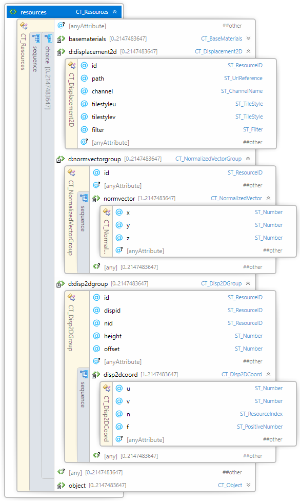
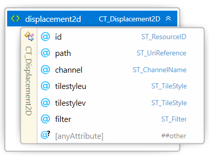
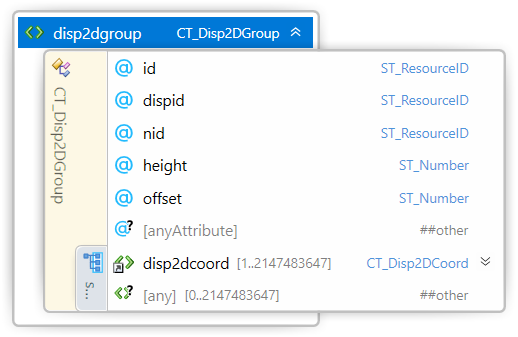
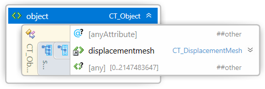

#
# 3MF Displacement Extension

## Specification & Reference Guide


| **Version** | 0.8.0 |
| --- | --- |
| **Status** | Draft |

## Table of Contents

- [Preface](#preface)
  * [About this Specification](#about-this-specification)
  * [Document Conventions](#document-conventions)
  * [Language Notes](#language-notes)
  * [Software Conformance](#software-conformance)
- [Part I: 3MF Documents](#part-i-3mf-documents)
  * [Chapter 1. Overview of Additions](#chapter-1-overview-of-additions)
  * [Chapter 2. Displacement Maps](#chapter-2-displacement-maps)
  * [Chapter 3. Resources](#chapter-3-resources)
    + [3.1 Displacement2D](#31-displacement2d)
    + [3.2 NormVectorGroup](#32-normvectorgroup)
    + [3.3 Disp2DGroup](#33-disp2dgroup)
  * [Chapter 4. Object](#chapter-4-object)
	+ [4.1 Displacement Mesh](#41-displacement-mesh)
  * [Chapter 5. Usage rules](#chapter-5-usage-rules)
	+ [5.1 Fill Rule](#51-fill-rule)
	+ [5.2 Adjacent Triangles](#52-adjacent-triangles)
	+ [5.3 Displacement Map and Properties](#53-displacement-map-and-properties)
- [Part II. Appendices](#part-ii-appendices)
  * [Appendix A. Glossary](#appendix-a-glossary)
  * [Appendix B. 3MF XSD Schema](#appendix-b-3mf-xsd-schema)
  * [Appendix C. Standard Namespace](#appendix-c-standard-namespace)
  * [Appendix D: Example file](#appendix-d-example-file)
- [References](#references)


# Preface

## About this Specification

This 3MF displacement specification is an extension to the core 3MF specification. This document cannot stand alone and only applies as an addendum to the core 3MF specification. Usage of this and any other 3MF extensions follow an a la carte model, defined in the core 3MF specification.

Part I, "3MF Documents," presents the details of the primarily XML-based 3MF Document format. This section describes the XML markup that defines the composition of 3D documents and the appearance of each model within the document.

Part II, "Appendices," contains additional technical details and schemas too extensive to include in the main body of the text as well as convenient reference information.

The information contained in this specification is subject to change. Every effort has been made to ensure its accuracy at the time of publication.

This extension MUST be used only with Core specification 1.x.

## Document Conventions

See [the 3MF Core Specification conventions](https://github.com/3MFConsortium/spec_core/blob/1.3.0/3MF%20Core%20Specification.md#document-conventions).

In this extension specification, as an example, the prefix "d" maps to the xml-namespace "http://schemas.microsoft.com/3dmanufacturing/displacement/2023/05". See Appendix [C.3 Namespaces](#c3-namespaces).

## Language Notes

See [the 3MF Core Specification language notes](https://github.com/3MFConsortium/spec_core/blob/1.3.0/3MF%20Core%20Specification.md#language-notes).

## Software Conformance

See [the 3MF Core Specification software conformance](https://github.com/3MFConsortium/spec_core/blob/1.3.0/3MF%20Core%20Specification.md#software-conformance).

# Part I: 3MF Documents

# Chapter 1. Overview of Additions

##### Figure 1-1: Encoding of an Initial sphere mesh (a), Encoding of a sphere mesh with a displacement map (b), Encoding of the re-tessellated sphere (c).

|  |  |  |
| :---: | :---: | :---: |
| Sphere mesh (27.500 triangles, 411kB). | Sphere mesh with greyscale displacement map (27.500 triangles, 1.2MB) | Re-tessellated Sphere mesh (660.000 triangles, 12.1MB)|

The rationale of the displacement specification extension is to enhance mesh geometry by a displacement mapping. This is achieved displacing the 3D mesh geometry using a scalar map that describes the offset in the direction of the displacement vector. This allows a very memory effective and accurate description of complex geometry.

This means that the displacement information of a triangle is given by:
- UV coordinates for each corner.
- A scalar 2D image for representing the "heightmap".
- A displacement vector for each corner which is interpolated on the surface.

This document describes a new element \<displacementmesh> in the \<object> elements choice that specifies a new object type, other than a mesh shape or components. This element is OPTIONAL for producers but MUST be supported by consumers that specify support for the 3MF Displacement Extension.

This is a non-backwards compatible change since it declares a different type of object. Therefore, a 3MF package which uses *displacementmesh* objects MUST enlist the 3MF Displacement Extension as “required extension”, as defined in the core specification.

##### Figure 2-2: Overview of model resources XML structure of 3MF with displacement additions.

#####


##### Figure 2-3: Overview of model object XML structure of 3MF with displacement additions.

#####


# Chapter 2. Displacement Maps

Displacement maps allow the producer to specify the macrostructure and mesostructure of a model separately. The macrostructure corresponds to the general shape of the object, and it is represented as a triangle mesh. We will call this the *base mesh*. The mesostructure contains higher frequency detail, like bumps on the surface of the model, and it is specified using a *displacement texture*. Figure 2-1 shows an example of a simple side of a mesh (a quad), the texture used as a displacement map, and the resulting displaced mesh.

##### Figure 2-1: Triangle of the base mesh in parametric form and its coverage of the parameter space. The displacement texture map occupies the square defined between coordinates (0, 0) and (1, 1). Black corresponds to a value of 0, while white does to a value of 1.


Let us denote a triangle *T* of the base mesh in parametric form $p(u, v)$, such that its three vertices $p_1, p_2, p_3$ have corresponding parametric coordinates $(u_1, v_1), (u_2, v_2), (u_3, v_3)$. Thus:

$$
    \begin{split}
        p_1 = p(u_1, v_1) \\
        p_2 = p(u_2, v_2) \\
        p_3 = p(u_3, v_3)
    \end{split}
$$

Specifying the triangle in this manner connects the position of any 3D point on it to a position in the corresponding 2D parameter space. If the displacement texture is then associated to the square defined between coordinates $(0, 0)$ and $(1, 1)$ in parameter space, a map between every point $p(u, v)$ on *T* and a value $dm(u, v)$ of the displacement texture is established. Figure 2-2 shows a triangle in 3D space, the texture coordinates of its vertices, and how the triangle is mapped to the parameter space. We will say that the coordinates $(u_1, v_1), (u_2, v_2), (u_3, v_3)$ are the displacement map texture coordinates of the vertices $p_1, p_2, p_3$ of T. Here, we assume that the displacement map texture $dm(u, v)$ returns values between zero and one.

##### Figure 2-2: Triangle of the base mesh in parametric form and its coverage of the parameter space. The displacement texture map occupies the square defined between coordinates (0, 0) and (1, 1). Black corresponds to a value of 0, while white does to a value of 1.


Denote as $n(u, v)$ the displacement vectors associated to each point of triangle *T*, and $f(u, v)$ as an associated scale factor. This factor will scale the effect of the displacement, so that its effect can be reduced at certain vertices. Then, the geometry $\tilde{p}$(u, v) of triangle *T* after displacement may be expressed as the sum of the base mesh and the displacement as:

$$ \tilde{p}(u, v) = p(u, v) + dm(u, v) \cdot f(u, v) \cdot n(u, v) $$

Figure 3 shows a triangle in the mesh is uv-mapped to a displacement texture:

##### Figure 2-3: The triangle from Fig. 2-2 after applying the corresponding part of the displacement map. Both the scale factor and the values in the displacement map affect the length of the displacement.


Then, to let the displacement values $dm(u, v)$ move in a specific range, *height* and *offset* are introduced. Sampling the displacement texture map produces values in the range [0, 1]. These are scaled using the formula:

$$ dm(u, v) = texture(u, v) \cdot height + offset $$

where $texture(u, v)$ denotes the value returned by sampling the displacement texture map at parametric coordinates $(u, v)$. Notice that, as $dm(u, v)$ is used to scale the displacement vector $n(u, v)$, the final size of the displacement at each point depends on $texture(u, v)$ and *height*. Figure 2-4 shows the result of choosing different values for these two parameters. The offset parameter is particularly useful to change what value of the texture produces no displacement. The *height* value may take negative values to produce displacement in the direction opposite to the specified displacement vectors.

##### Figure 2-4: Scaling a displacement map. Dark blue is the base mesh. Light blue, the displaced result.

|  |  |  |  |
| :---: | :---: | :---: | :---: |
| Base quad | Offset = 0 and height = 1 | Offset = −0.5 and height = 1 | Offset = 0 and height = 2 |

Regarding the displacement vectors *n(u, v)*, we could use the normal of each triangle *T* for the displacement
produced from *T*. Better control may be provided by assigning normalized displacement vectors $n_1, n_2, n_3$ at each
of its vertices and interpolating them linearly. Figure 2-5 shows this effect.

##### Figure 2-5: Being able to specify different displacement vectors per vertex enables more control.


Assume we want to compute the displacement vector for a point P that has barycentric coordinates $\alpha_1$, $\alpha_2$, $\alpha_3$ inside a triangle with vertices $p_1$, $p_2$ and $p_3$. Thus:

$$  P = \alpha_1 p_1 + \alpha_2 p_2 + \alpha_3 p_3 $$

If the vertices have displacement texture coordinates ($u_1$, $v_1$), ($u_2$, $v_2$), ($u_3$, $v_3$), the texture coordinates of point *P* are:

$$ (u, v) = (\alpha_1u_1 + \alpha_2u_2 + \alpha_3u_3, \alpha_1v_1 + \alpha_2v_2 + \alpha_3v_3) $$

and given that the normalized displacement vectors associated to the triangle’s three vertices are $n_1$, $n_2$, $n_3$, the normalized displacement vector at *P* is:

$$ n(u,v) = \frac{\alpha_1 n_1 + \alpha_2 n_2 + \alpha_3 n_3}{\|\alpha_1 n_1 + \alpha_2 n_2 + \alpha_3 n_3\|} $$

The same is done for the scale factors. They are specified at the vertices as $f_1, f_2, f_3$, and interpolated
inside a triangle using barycentric coordinates:

$$ f(u,v) = \alpha_1 f_1 + \alpha_2 f_2 + \alpha_3 f_3 $$

We also need to define what happens for texture coordinates outside the domain $[0, 1]^2$. there are several methods to deal with this case: *wrap*, *mirror*, *clamp*, and *none*. Figures 1-8 and 1-9 show how they work.

Assume we are applying a displacement texture of $W × H$ pixels, and want to determine the value at texture coordinates $(u, v)$. We first transform $(u, v)$ to image space (see Figure 2-6):

$$ (u, v) \longrightarrow (i_c, j_c) = \big((1-v)\cdot H-0.5, u\cdot W-0.5\big) $$

##### Figure 2-6: Texture coordinates need to be transformed to image space, so the corresponding texels may be accessed.


Then, if the filtering mode is *nearest*, the displacement value is $C\big(round(i_c), round(j_c)\big)$, where $C(\cdot, \cdot)$ is a function that retrieves the value from the tiled image, to be detailed below.

If the filtering mode is *linear* instead, then let:

$$
    \begin{array}{ll}
        i_0=\lfloor i_c\rfloor;&\qquad i_1=i_0+1\\
        j_0=\lfloor j_c\rfloor; &\qquad j_1=j_0+1\\
    \end{array}
$$

The four closest pixels are $(i_0, j_0)$, $(i_0, j_1)$, $(i_1, j_0)$ and $(i_1, j_1)$, and the filtered displacement value can now be computed as 
follows:

$$
    \begin{array}{rcl}
        \lambda_i&=&i_c-\lfloor i_c\rfloor\\
        \lambda_j&=&j_c-\lfloor j_c\rfloor\\
        dm(u,v) &=
            & C(i_0, j_0)(1-\lambda_i)(1-\lambda_j)+\\
            && C(i_0, j_1)(1-\lambda_i)\lambda_j+\\
            && C(i_1, j_0)\lambda_i(1-\lambda_j)+\\
            && C(i_1, j_1)\lambda_i\lambda_j
    \end{array}
$$

The effect of the two filtering modes is presented in Figure 2-7.

##### Figure 2-7: Effect of filter modes on the displacement.

|  |  |  |
| :---: | :---: | :---: |
| Simple 3×3 displacement texture | Result with filter mode *nearest* | Result with filter mode *linear* |

This integer coordinates $(i, j)$ may range over $[0, 1]^2$. To retrieve the actual value then we need to map them onto an equivalent pair $(i^\prime, j^\prime)\in \\{0..H-1\\}\times \\{0..W-1 \\}$ of the same value, which is done independently on each component, using the tiling option for the corresponding direction. If L denotes the length of the image in the direction under scrutiny (*H* for *i*, and *W* for *j*), then:

$$
	\begin{array}{rcl}
	\mathtt{CLAMP}(x, L)&=&\min\big(L-1, \max(x, 0)\big)\\
	\mathtt{WRAP}(x, L)&=& x - \Big\lfloor \frac{x}{L}\Big\rfloor\cdot L\\
	\mathtt{MIRROR}(x, L)&=&   \begin{cases}
		x - \Big\lfloor \frac{x}{L}\Big\rfloor\cdot L & \qquad\left\lfloor \frac{x}{L}\right\rfloor\equiv 0\,(\mathrm{mod~}2)\\ 
		\left(\Big\lfloor\frac{x}{L}\Big\rfloor+1\right)\cdot L - x -1& \qquad \mathrm{otherwise}\\
	\end{cases}\\
	\mathtt{NONE}(x, L)&=& x%\\
	\end{array}
$$

If $TILE_i$ denotes whichever of these three functions applies in direction *i*, then:

$$ C(i, j) =  \begin{cases}
    \mathtt{IMAGE}\big[\mathtt{TILE}_i(i, H)\big]\big[\mathtt{TILE}_j(j, W)\big] & \text{$(\mathtt{TILE}_i \neq \mathtt{NONE}$ or $0 \leq i < L$) and} \\
     & \text{$(\mathtt{TILE}_j \neq \mathtt{NONE}$ or $0 \leq j < L$)} \\
    0 & \mathrm{otherwise}\\
\end{cases}
$$

where the result of applying $TILE_i$ is always an integer in $\\{0..L-1\\}$, and they all reduce to the identity if their first argument is already in that range.

##### Figure 2-8: The different tiling texture modes control how the displacement texture image is extended outside the square between $(0, 0)$ and $(1, 1)$.


##### Figure 2-9: Results of applying the texture of Fig. 8a using different tiling texture modes to a quad base mesh with texture coordinates between $(-1, -1)$ and $(2, 2)$.

|  |  |  |  |
| :---: | :---: | :---: | :---: |
| WRAP | MIRROR | CLAMP | NONE |

# Chapter 3. Resources

## 3.1 Displacement2D
Element **\<displacement2d>**



| Name   | Type   | Use   | Default   | Annotation |
| --- | --- | --- | --- | --- |
| id | **ST\_ResourceID** | required |   | ResourceID of this displacement resource. |
| path | **ST\_UriReference** | required |   | Path to the displacement image file. |
| contenttype | **ST\_ContentType** | required |   | Content type of the texture resource. PNG or JPEG allowed. |
| channel | **ST\_ChannelName** |  | G | Specifies which channel to reference in the displacement texture. Valid values are R, G, B. Ignored for monochromatic images. |
| tilestyleu | **ST_TileStyle** |  | wrap | Specifies how tiling should occur in the u axis in order to fill the overall requested area. Valid values are wrap, mirror, clamp, none. |
| tilestylev | **ST_TileStyle** |  | wrap | Specifies how tiling should occur in the v axis in order to fill the overall requested area. Valid values are wrap, mirror, clamp, none. |
| filter | **ST_Filter** |  | auto | Specifies the texture filter to apply when scaling the source texture.  Allowed values are “auto”, “linear”, “nearest”. |
| @anyAttribute | | | | |

A displacement texture resource provides information about texture image data, found via the provided path reference, which MUST also be the target of a 3D Texture relationship from the 3D Model part. 

**id** - Specifies a unique identifier for this displacement resource. 

**path** - Specifies the path to the displacement image file.

**contenttype** - The only supported content types are JPEG and PNG, as described in the 3MF core spec under the [6.1. Thumbnail](https://github.com/3MFConsortium/spec_core/blob/1.3.0/3MF%20Core%20Specification.md#61-thumbnail) section.

**channel** - The channel attribute selects which of the R, G, B or A channels defines the displacement texture. For monochromatic images, the R, G or B channels are equivalent to the grayscale value of the image.

The displacement texture values range are independent from the image coding range, either 8-bit or 16-bit, and normalized to [0, 1] range. The normalized displacement values are obtained by dividing each channel by 2<sup>n</sup>-1, where n is the number of bits per channel. For example, in an 8-bit image the pixel values MUST be divided by 255.

**tilestyleu, tilestylev** - The tile style of "wrap" essentially means that the same displacement texture SHOULD be repeated in the specified axis (both in the positive and negative directions), for the axis value. The tile style of "mirror" means that each time the displacement texture width or height is exceeded, the next repetition of the texture SHOULD be reflected across a plane perpendicular to the axis in question. The tile style of "clamp" means all Displacement 2D Coordinates outside of the range zero to one will be assigned the displacement value of the nearest edge pixel. The tile style of "none" means that all Displacement 2D Coordinates outside the range zero to one will not have a displacement and stay on the triangle's surface.

**filter** - The producer MAY require the use of a specific filter type by specifying either “linear” for bilinear interpolation or “nearest” for nearest neighbor interpolation. The producer SHOULD use “auto” to indicate to the consumer to use the highest quality filter available. If the source texture is scaled with the model, the specified filter type MUST be applied to the scaling operation. The default value is “auto”.

## 3.2 NormVectorGroup
Element **\<normvectorgroup>**


| Name   | Type   | Use   | Default   | Annotation |
| --- | --- | --- | --- | --- |
| id | **ST\_ResourceID** | required |   | ResourceID of this NormVectorGroup resource |
| @anyAttribute | | | | |

A \<normvectorgroup> element acts as a container for normalized vectors properties. The order of these elements forms an implicit 0-based index that is referenced by the \<disp2dcoords> element.

To avoid integer overflows, a texture coordinate group MUST contain less than 2^31 disp2dcoords.

**id** - Specifies a unique identifier for this displacement resource. 

### 3.2.1 NormVector
Element **\<normvector>**


| Name   | Type   | Use   | Default   | Annotation |
| --- | --- | --- | --- | --- |
| x | **ST\_Number** | required |   | X-component of the normalized displacement vector. |
| y | **ST\_Number** | required |   | Y-component of the normalized displacement vector. |
| z | **ST\_Number** | required |   | Z-component of the normalized displacement vector. |
| @anyAttribute | | | | |

The \<normvector> element defines the direction where the displacement is applied. The \<normvector> element MUST be normalized by the producer so the module of the displacement vector is 1.0. Consumers SHOULD accept non-normalized vectors but normalize them before applying.

**x, y, z** - The X, Y and Z components of the normalized vector group.

The normalized vectors MUST point to the triangle's outer hemisphere of the triangle. The scalar product of a normalized displacement vector to the triangle normal MUST be greater than 0.

Normalized displacement vectors MUST be linearly interpolated to spread the displacement map along a surface. All interpolated vectors MUST be normalized before being applied.

The displacement vector specifies the direction:

	displacement vector = dm(u,v) * f(u,v) * n(u,v)

Which is:

	displacement vector = displacement map * factor * normalized vector

## 3.3 Disp2DGroup
Element **\<disp2dgroup>**



| Name   | Type   | Use   | Default   | Annotation |
| --- | --- | --- | --- | --- |
| id | **ST\_ResourceID** | required |   | ResourceID of this Disp2dGroup resource |
| dispid | **ST\_ResourceID** | required |   | ID of the Displacement map used in this group |
| nid | **ST\_ResourceID** | required | | ID of the normalized vector group used in this group |
| height | **ST\_Number** | required |   | The amplitude of the mapped values in the texture |
| offset | **ST\_Number** |  |  0 | Offset to the displacement map amplitude |
| @anyAttribute | | | | |

A \<disp2dgroup> element acts as a container for texture coordinate properties. The order of these elements forms an implicit 0-based index that is referenced by other elements, such as the \<object> and \<triangle> elements. It also specifies which image to use, via dispid. The referenced \<displacement2d> elements are described above in [2.1 Displacement2D](#21-displacement2d).

**id** - Specifies a unique identifier for this displacement resource. 

**dispid** - Selects the ID of the Displacement map used in this displacement group. 

**nid** - Specifies the normalized vector group used in this displacement group. 

**height** - The height attribute defines the displacement amplitude in the model units for the maximum texture value range.

**offset** - The offset attribute defines the displacement offset in the model units. The offset default value is 0.

The displacement map (dm), at barycentric coordinates u, v,is computed by:

	dm(u,v) = texture(u,v) * height + offset

where the texture value is in the range [0, 1], and the displacement map is applied in the model unit resolution, as specified in the 3MF core specification ([3.4 Model](https://github.com/3MFConsortium/spec_core/blob/1.3.0/3MF%20Core%20Specification.md#34-model)).

A positive displacement map specifies an embossing and a negative displacement map specifies a debossing of the original mesh.

To avoid integer overflows, a texture coordinate group MUST contain less than 2^31 disp2dcoords.

### 3.3.1 Disp2DCoords
Element **\<disp2dcoords>**


| Name   | Type   | Use   | Default   | Annotation |
| --- | --- | --- | --- | --- |
| u | **ST\_Number** | required |   | The u-coordinate within the texture, horizontally right from the left of the texture. |
| v | **ST\_Number** | required |   | The v-coordinate within the texture, vertically up from the bottom of the texture.|
| n | **ST\_ResourceIndex** | required |   | Index to the normalized displacement vector to apply to these coordinates. |
| f | **ST\_PositiveNumber** |  |  1 | Optional displacement factor. |
| @anyAttribute | | | | |

The \<disp2dcoords> element maps a vertex of a triangle to a position in image space (U, V coordinates). Displacement mapping allows texture images to  produce a new geometry by the displacement of the surface triangle.

**u, v** - The U, V coordinates within the texture image. The lower left corner of the texture is the u, v coordinate (0,0), and the upper right coordinate is (1,1). The UV values are not restricted to this range. When the UV coordinates exceed the [0,1] range, the tilestyleu and tilestylev MUST be applied according to the tiling specified in [3.1 Displacement2D](#31-displacement2d).

**n** - The index to the normalized displacement vector, defined by the \<normvector> elements in the selected \<normvectorgroup>.

**f** - The optional displacement factor applied to the texture(u,v) value, in order to modulate the displacement vector across a triangle.

	p'(u, v) = p(u, v) + dm(u, v) · f(u, v) · n(u, v)

>**Note:** the *f* attribute allow to soften the displacement at the boundaries of the displaced surface.

# Chapter 4. Object

Element **\<object>**



The \<object> element is enhanced with an additional element \<displacementmesh> in the object choice, declaring that the object represents a modified mesh shape specifying optional displacement surfaces in the triangles. This extends [the 3MF Core Specification object resources](https://github.com/3MFConsortium/spec_core/blob/1.2.3/3MF%20Core%20Specification.md#chapter-4-object-resources).

The _object_ containing the _displacementmesh_ MUST be an object of type "model".

## 4.1 Displacement Mesh

Element **\<displacementmesh>**


The \<displacementmesh> element is the root of a triangular _displacement mesh_ shape representation of an object volume. It contains a set of vertices and a set of triangles, similarly to the triangle mesh specified in ([the 3MF Core Specification Meshes](https://github.com/3MFConsortium/spec_core/blob/1.3.0/3MF%20Core%20Specification.md#41-meshes)).

The <displacementmesh> element is the root of a triangular _displacement mesh_ shape representation of an object volume. If extends the vertices and triangles defined in _mesh_ element in the core specification by specifying optional displacement attributes in the triangles of the mesh. All the mesh rules specified in the ([the 3MF Core Specification Meshes](https://github.com/3MFConsortium/spec_core/blob/1.3.0/3MF%20Core%20Specification.md#41-meshes)) equally apply to the _displacementmesh_.

Since the displacement information in the triangles is optional, it is possible to specify a _displacementmesh_ with no displaced triangles. However, producers SHOULD convert those _displacementmesh_ to a triangle _mesh_ shape. The _displacementmesh_ shape SHOULD only be used when any triangle in the mesh contains displacement attributes.

To be decoupled from 3MF extension to the _mesh_ element in the Core Specification, all elements under \<displacementmesh> MUST be used specifying the _displacement_ namespace_. See example below:

```xml
<d:displacementmesh>
    <d:vertices>
        <d:vertex x="152.345" y="84.2476" z="16.92"/>
        <d:vertex x="192.345" y="84.2476" z="16.92"/>
        <d:vertex x="172.347" y="104.25" z="56.918"/>
        <d:vertex x="152.345" y="124.248" z="16.92"/>
        <d:vertex x="192.345" y="124.248" z="16.92"/>
    </d:vertices>
    <d:triangles did="18">
        <d:triangle v1="0" v2="1" v3="2" d1="0" d2="1" d3="2"/>
      	<d:triangle v1="3" v2="1" v3="0" d1="3" d2="4" d3="5"/>
        <d:triangle v1="0" v2="2" v3="3"/>
        <d:triangle v1="1" v2="4" v3="2" d1="6" d2="8" d3="2"/>
        <d:triangle v1="4" v2="3" v3="2"/>
        <d:triangle v1="4" v2="1" v3="3" d1="7" d2="4" d3="3"/>
    </d:triangles>
</d:displacementmesh>
```

### 4.1.1 Vertices

Element **\<vertices>**


The \<vertices> element contains all the <vertex> elements for this object. The vertices represent the corners of each triangle in the mesh. The \<vertices> element inherit the definition and restrictions from ([the 3MF Core Specification Vertices](https://github.com/3MFConsortium/spec_core/blob/1.3.0/3MF%20Core%20Specification.md#413-vertices)).

### 4.1.1.1 Vertex

Element **\<vertex>**


The \<vertex> element represents a point in 3-dimensional space that is referenced by a triangle in the mesh. The \<vertex> element inherit the definition and restrictions from ([the 3MF Core Specification Vertex](https://github.com/3MFConsortium/spec_core/blob/1.3.0/3MF%20Core%20Specification.md#4131-vertex)).

### 4.1.2 Triangles

Element **\<triangles>**


| Name   | Type   | Use   | Default   | Annotation |
| --- | --- | --- | --- | --- |
| did | **ST\_ResourceID** | | | Optional default displacement group id. |
| @anyAttribute | | | | |

The \<triangles> element contains a set of 4 or more \<triangle> elements to describe the 3D object displacement mesh. The \<triangles> element inherit the definition and restrictions from ([the 3MF Core Specification Triangles](https://github.com/3MFConsortium/spec_core/blob/1.3.0/3MF%20Core%20Specification.md#414-triangles)).

**did** - Specifies the default displacement map ID for the triangles in the _displacement mesh_. This ID MUST be ignored if no displacement maps is selected in any triangle.

### 4.1.2.1 Triangle

Element **\<triangle>**


| Name   | Type   | Use   | Default   | Annotation |
| --- | --- | --- | --- | --- |
| d1 | **ST\_ResourceIndex** | | | Displacement map index for the first vertex of the triangle. |
| d2 | **ST\_ResourceIndex** | | | Displacement map index for the second vertex of the triangle. |
| d3 | **ST\_ResourceIndex** | | | Displacement map index for the third vertex of the triangle. |
| did | **ST\_ResourceID** | | | Displacement map id for the triangle. When specified. |
| @anyAttribute | | | | |

The \<triangle> element represents a single face of the displacement mesh. The \<triangle> element inherit the definition and restrictions from ([the 3MF Core Specification Triangle](https://github.com/3MFConsortium/spec_core/blob/1.3.0/3MF%20Core%20Specification.md#4141-triangle)).

In addition to the attributes specified in the 3MF core specification the \<triangle> element is extended with the optional displacement map for each vertex.

**did** - Specifies the displacement group ID for the triangles in the mesh, overriding the default displacement map ID in the enclosing \<triangles> element, whether specified. The "did" is ignored is no displacement maps indices are selected in triangle. The "did" MUST be specified if "d1" is specified and no "did" is specified at _triangles_ level.

**d1, d2, d3** - Specify the indices to the displacement maps in the selected displacement group for the vertices "v1", "v2" and "v3", respectively.

The displacement map applied to each vertex (d1, d2, d3) allows displacement to be defined across the triangle by mapping to the displacement texture and the displacement vector.

The displacement group is specified by the "did" attribute. Since this is applied to the whole triangle, it implicitly forces the three displacement map indices to belong to the same group. If "d1" is specified then the "did" attribute MUST be specified, either in the triangle or in the enclosing _triangles_. If "d2" or "d3" are unspecified then "d1" is used for the entire triangle. If "d1" is unspecified then no displacement map is applied to the triangle, and the "did" is ignored.

As the displacement maps applied to a displacement mesh defines a new shape, any transform to the object MUST be applied to that new shape.

# Chapter 5. Usage rules

There are a few rules for interpreting the displacement maps for obtaining the final shape: fill rule, adjacent triangles and triangle properties.

## 5.1 Fill Rule

When applying the displacement map to a mesh, the resultant shape might be embossed, or debossed. This shape change might result in shape self-intersections or holes.

The final shape MUST be resolved by applying the *Fill Rule* as defined in the 3MF core specification ([4.1.1 Fill Rule](https://github.com/3MFConsortium/spec_core/blob/1.3.0/3MF%20Core%20Specification.md#411-fill-rule)).

For efficient displacement maps the producer SHOULD not generate self-intersecting displaced shapes, since this MAY cause overhead in the consumer.

## 5.2 Adjacent Triangles

Applying its displacement to each of the triangles on a mesh only works if the connection between adjacent triangles is maintained. Otherwise, the same vertex on two different triangles may be displaced to a different point in space. This may happen in two different cases (illustrated in Figure 10):

1. If a vertex is used in two different triangles with either different displacement texture coordinates or displacement textures, and this results in two different displacement values, even though the displacement vectors used are the same. 

2. If a vertex is used in two different triangles with different displacement vectors.

These cases are only possible because a single vertex may be used on different triangles. Each of these triangles may have different displacement vectors, displacement textures, and/or displacement texture coordinates.

In the first case (Figure 5-1), the displaced surfaces obtained from *T1* and *T2* are connected directly, ignoring the original edge *e* that connected *T1* and *T2*.

##### Figure 5-1: Displacements may disagree on the edges between displacement groups. When the directions agree, but the displacement values do not, the displaced edges are connected directly.

|  |  |  |  |
| :---: | :---: | :---: | :---: |
| Displacement 2D view | Quad surface with shared displacement vectors | Displaced surfaces showing discontinuity | Directly connected displaced surfaces |

In the second case (Figure 5-2), if the surface breaks along an edge *e* between two triangles *T1* and *T2*, this is avoided by connecting the surfaces displaced from the two triangles to the original edge *e*.

##### Figure 5-2: Displacements may disagree on the edges between displacement groups. When the directions do not match, the original edge serves to connect the result of displacing the two triangles.

|  |  |  |  |
| :---: | :---: | :---: | :---: |
| Displacement 2D view | Quad surface with different displacement vectors | Displaced surfaces showing discontinuity | Connected displaced surfaces through the original edge |

The displaced surface may have self-intersections. But if this is the case, the *Fill Rule* as defined in the 3MF core specification ([4.1.1 Fill Rule](https://github.com/3MFConsortium/spec_core/blob/1.3.0/3MF%20Core%20Specification.md#411-fill-rule)) SHOULD be used to determine which parts are inside the volume (see Figure 5-3).

##### Figure 5-3: In this example, all the displacement vectors point outwards, but height = 40 and offset = -20. As a result, displacement values are produced within a range of [-20, 20]. Moreover, the displacement texture is a mix of noise and a gradient, which produces self-intersections in the edge common to the two displaced faces of the base cube. These are solved according to the 3MF fill rule.

|  |  |  |  |
| :---: | :---: | :---: | :---: |
| Displacement 2D view | Quad surface with different displacement vectors | Displaced surfaces showing discontinuity | Connected displaced surfaces through the original edge |

## 5.3 Displacement Map and Properties

The displacement map MIGHT be combined with another property, for example color, color textures, multiproperties, as defined in the [3MF Materials and Properties Extension](https://github.com/3MFConsortium/spec_materials/blob/master/3MF%20Materials%20Extension.md). When combined, the properties are first applied to the triangle and then the triangle with the properties MUST be displaced by the displacement map.

In case of a color texture, the texture coordinates will be linearly interpolated over the surface, before applying the displacement map. Actual color lookup will happen then after applying the displacement, using these coordinates.

# Part II. Appendices

## Appendix A. Glossary

See [the 3MF Core Specification glossary](https://github.com/3MFConsortium/spec_core/blob/1.3.0/3MF%20Core%20Specification.md#appendix-a-glossary).

## Appendix B. 3MF XSD Schema

```xml
<?xml version="1.0" encoding="UTF-8"?> 
<xs:schema xmlns="http://schemas.microsoft.com/3dmanufacturing/displacement/2023/10"
	xmlns:xs="http://www.w3.org/2001/XMLSchema"
	xmlns:core="http://schemas.microsoft.com/3dmanufacturing/core/2015/02"
	targetNamespace="http://schemas.microsoft.com/3dmanufacturing/displacement/2023/10"
	elementFormDefault="unqualified" attributeFormDefault="unqualified" blockDefault="#all">
	<xs:import namespace="http://www.w3.org/XML/1998/namespace"
		schemaLocation="http://www.w3.org/2001/xml.xsd"/>
	<xs:import namespace="http://schemas.microsoft.com/3dmanufacturing/core/2015/02" schemaLocation="core_1.2.xsd"/>
	<xs:annotation>
		<xs:documentation><![CDATA[   Schema notes: 
 
  Items within this schema follow a simple naming convention of appending a prefix indicating the type of element for references: 
 
  Unprefixed: Element names 
  CT_: Complex types 
  ST_: Simple types 
   
  ]]></xs:documentation>
	</xs:annotation>

	<!-- Complex Types -->
	<xs:complexType name="CT_Resources">
		<xs:sequence>
			<xs:choice minOccurs="0" maxOccurs="2147483647">
				<xs:element ref="displacement2d" minOccurs="0" maxOccurs="2147483647"/>
				<xs:element ref="normvectorgroup" minOccurs="0" maxOccurs="2147483647"/>
				<xs:element ref="disp2dgroup" minOccurs="0" maxOccurs="2147483647"/>
				<xs:any namespace="##other" processContents="lax" minOccurs="0"
					maxOccurs="2147483647"/>
			</xs:choice>
		</xs:sequence>
		<xs:anyAttribute namespace="##other" processContents="lax"/>
	</xs:complexType>

	<xs:complexType name="CT_Displacement2D">
		<xs:attribute name="id" type="ST_ResourceID" use="required"/>
		<xs:attribute name="path" type="ST_UriReference" use="required"/>
		<xs:attribute name="contenttype" type="ST_ContentType" use="required"/>
		<xs:attribute name="channel" type="ST_ChannelName" default="G"/>
		<xs:attribute name="tilestyleu" type="ST_TileStyle" default="wrap"/>
		<xs:attribute name="tilestylev" type="ST_TileStyle" default="wrap"/>
		<xs:attribute name="filter" type="ST_Filter" default="auto"/>
		<xs:anyAttribute namespace="##other" processContents="lax"/>
	</xs:complexType>

	<xs:complexType name="CT_Disp2DGroup">
		<xs:sequence>
			<xs:element ref="disp2dcoord" minOccurs="1" maxOccurs="2147483647"/>
			<xs:any namespace="##other" processContents="lax" minOccurs="0" maxOccurs="2147483647"/>
		</xs:sequence>
		<xs:attribute name="id" type="ST_ResourceID" use="required"/>
		<xs:attribute name="dispid" type="ST_ResourceID" use="required"/>
		<xs:attribute name="nid" type="ST_ResourceID" use="required"/>
		<xs:attribute name="height" type="ST_Number" use="required"/>
		<xs:attribute name="offset" type="ST_Number" default="0"/>
		<xs:anyAttribute namespace="##other" processContents="lax"/>
	</xs:complexType>

	<xs:complexType name="CT_NormalizedVectorGroup">
		<xs:sequence>
			<xs:element ref="normvector" minOccurs="1" maxOccurs="2147483647"/>
			<xs:any namespace="##other" processContents="lax" minOccurs="0" maxOccurs="2147483647"/>
		</xs:sequence>
		<xs:attribute name="id" type="ST_ResourceID" use="required"/>
		<xs:anyAttribute namespace="##other" processContents="lax"/>
	</xs:complexType>

	<xs:complexType name="CT_NormalizedVector">
		<xs:attribute name="x" type="ST_Number" use="required"/>
		<xs:attribute name="y" type="ST_Number" use="required"/>
		<xs:attribute name="z" type="ST_Number" use="required"/>
		<xs:anyAttribute namespace="##other" processContents="lax"/>
	</xs:complexType>

	<xs:complexType name="CT_Disp2DCoord">
		<xs:attribute name="u" type="ST_Number" use="required"/>
		<xs:attribute name="v" type="ST_Number" use="required"/>
		<xs:attribute name="n" type="ST_ResourceIndex" use="required"/>
		<xs:attribute name="f" type="ST_PositiveNumber" default="1"/>
		<xs:anyAttribute namespace="##other" processContents="lax"/>
	</xs:complexType>

	<xs:complexType name="CT_Object">
		<xs:sequence>
			<xs:choice>
				<xs:element ref="displacementmesh"/>
			</xs:choice>
			<xs:any namespace="##other" processContents="lax" minOccurs="0" maxOccurs="2147483647"/>
		</xs:sequence>
		<xs:attribute name="did" type="ST_ResourceID"/>
		<xs:anyAttribute namespace="##other" processContents="lax"/>
	</xs:complexType>

	<xs:complexType name="CT_DisplacementMesh">
		<xs:sequence>
			<xs:element ref="vertices"/>
			<xs:element ref="triangles"/>
			<xs:any namespace="##other" processContents="lax" minOccurs="0" maxOccurs="2147483647"/>
		</xs:sequence>
		<xs:anyAttribute namespace="##other" processContents="lax"/>
	</xs:complexType>

	<xs:complexType name="CT_Vertices">
		<xs:sequence>
			<xs:element ref="vertex" minOccurs="3" maxOccurs="2147483647"/>
		</xs:sequence>
		<xs:anyAttribute namespace="##other" processContents="lax"/>
	</xs:complexType>

	<xs:complexType name="CT_Vertex">
		<xs:complexContent>
			<xs:extension base="core:CT_Vertex"/>
		</xs:complexContent>
	</xs:complexType>

	<xs:complexType name="CT_Triangles">
		<xs:sequence>
			<xs:element ref="triangle" minOccurs="4" maxOccurs="2147483647"/>
		</xs:sequence>
		<xs:attribute name="did" type="ST_ResourceID"/>
		<xs:anyAttribute namespace="##other" processContents="lax"/>
	</xs:complexType>

	<xs:complexType name="CT_Triangle">
		<xs:complexContent>
			<xs:extension base="core:CT_Triangle">
				<xs:attribute name="d1" type="ST_ResourceIndex"/>
				<xs:attribute name="d2" type="ST_ResourceIndex"/>
				<xs:attribute name="d3" type="ST_ResourceIndex"/>
				<xs:attribute name="did" type="ST_ResourceID"/>
			</xs:extension>
		</xs:complexContent>
	</xs:complexType>

	<!-- Simple Types -->
	<xs:simpleType name="ST_ContentType">
		<xs:restriction base="xs:string">
			<xs:enumeration value="image/jpeg"/>
			<xs:enumeration value="image/png"/>
		</xs:restriction>
	</xs:simpleType>
	<xs:simpleType name="ST_ChannelName">
		<xs:restriction base="xs:string">
			<xs:enumeration value="R"/>
			<xs:enumeration value="G"/>
			<xs:enumeration value="B"/>
			<xs:enumeration value="A"/>
		</xs:restriction>
	</xs:simpleType>
	<xs:simpleType name="ST_TileStyle">
		<xs:restriction base="xs:string">
			<xs:enumeration value="clamp"/>
			<xs:enumeration value="wrap"/>
			<xs:enumeration value="mirror"/>
			<xs:enumeration value="none"/>
		</xs:restriction>
	</xs:simpleType>
	<xs:simpleType name="ST_Filter">
		<xs:restriction base="xs:string">
			<xs:enumeration value="auto"/>
			<xs:enumeration value="linear"/>
			<xs:enumeration value="nearest"/>
		</xs:restriction>
	</xs:simpleType>
	<xs:simpleType name="ST_UriReference">
		<xs:restriction base="xs:anyURI">
			<xs:pattern value="/.*"/>
		</xs:restriction>
	</xs:simpleType>
	<xs:simpleType name="ST_Number">
		<xs:restriction base="xs:double">
			<xs:whiteSpace value="collapse"/>
			<xs:pattern value="((\-|\+)?(([0-9]+(\.[0-9]+)?)|(\.[0-9]+))((e|E)(\-|\+)?[0-9]+)?)"/>
		</xs:restriction>
	</xs:simpleType>
	<xs:simpleType name="ST_PositiveNumber">
		<xs:restriction base="xs:double">
			<xs:whiteSpace value="collapse"/>
			<xs:pattern value="((\+)?(([0-9]+(\.[0-9]+)?)|(\.[0-9]+))((e|E)(\-|\+)?[0-9]+)?)"/>
		</xs:restriction>
	</xs:simpleType>
	<xs:simpleType name="ST_ResourceID">
		<xs:restriction base="xs:positiveInteger">
			<xs:maxExclusive value="2147483648"/>
		</xs:restriction>
	</xs:simpleType>

	<xs:simpleType name="ST_ResourceIndex">
		<xs:restriction base="xs:nonNegativeInteger">
			<xs:maxExclusive value="2147483648"/>
		</xs:restriction>
	</xs:simpleType>

	<!-- Attributes -->

	<!-- Elements -->
	<xs:element name="resources" type="CT_Resources"/>
	<xs:element name="displacement2d" type="CT_Displacement2D"/>
	<xs:element name="normvectorgroup" type="CT_NormalizedVectorGroup"/>
	<xs:element name="normvector" type="CT_NormalizedVector"/>
	<xs:element name="disp2dgroup" type="CT_Disp2DGroup"/>
	<xs:element name="disp2dcoord" type="CT_Disp2DCoord"/>
	<xs:element name="object" type="CT_Object"/>
	<xs:element name="displacementmesh" type="CT_DisplacementMesh"/>
	<xs:element name="vertices" type="CT_Vertices"/>
	<xs:element name="vertex" type="CT_Vertex"/>
	<xs:element name="triangles" type="CT_Triangles"/>
	<xs:element name="triangle" type="CT_Triangle"/>
</xs:schema>
```

# Appendix C. Standard Namespace

| | |
| --- | --- |
|Displacement | [http://schemas.microsoft.com/3dmanufacturing/displacement/2023/05](http://schemas.microsoft.com/3dmanufacturing/displacement/2023/05) |

# Appendix D: Example file

## 3D model
```xml
<?xml version="1.0" encoding="UTF-8"?>
<model xmlns="http://schemas.microsoft.com/3dmanufacturing/core/2015/02"
  xmlns:d="http://schemas.microsoft.com/3dmanufacturing/displacement/2023/10"
  unit="millimeter" xml:lang="en-US">
  <resources>
    <d:displacement2d id="10" path="/3D/Textures/label_mono.png" contenttype="image/png"/>
    <d:normvectorgroup id="24">
      <d:normvector x="-0.704662" y="-0.704662" z="-0.0830916"/>
      <d:normvector x="0.704672" y="-0.704644" z="-0.0831468"/>
      <d:normvector x="2.02911e-5" y="2.00578e-5" z="1"/>
      <d:normvector x="-0.704644" y="0.704673" z="-0.0831459"/>
      <d:normvector x="0.704655" y="0.704655" z="-0.083201"/>
    </d:normvectorgroup>
    <d:disp2dgroup id="18" dispid="10" nid="24" depth="1.5">
      <d:disp2dcoord u="0" v="0" n="0"/>
      <d:disp2dcoord u="1" v="0" n="1"/>
      <d:disp2dcoord u="0.50005" v="1" n="2"/>
      <d:disp2dcoord u="1" v="1" n="3"/>
      <d:disp2dcoord u="0" v="5.96046e-008" n="1"/>
      <d:disp2dcoord u="1" v="5.96046e-008" n="0"/>
      <d:disp2dcoord u="-5.96046e-008" v="0" n="1"/>
      <d:disp2dcoord u="0" v="1" n="4"/>
      <d:disp2dcoord u="1" v="0" n="4"/>
    </d:disp2dgroup>
    <object id="9" name="Scene - DispMaps_13" thumbnail="/Thumbnails/Scene_DispMaps_13.png" type="model">
      <d:displacementmesh>
        <d:vertices>
          <d:vertex x="152.345" y="84.2476" z="16.92"/>
          <d:vertex x="192.345" y="84.2476" z="16.92"/>
          <d:vertex x="172.347" y="104.25" z="56.918"/>
          <d:vertex x="152.345" y="124.248" z="16.92"/>
          <d:vertex x="192.345" y="124.248" z="16.92"/>
        </d:vertices>
        <d:triangles did="18">
          <d:triangle v1="0" v2="1" v3="2" d1="0" d2="1" d3="2"/>
          <d:triangle v1="3" v2="1" v3="0" d1="3" d2="4" d3="5"/>
          <d:triangle v1="0" v2="2" v3="3"/>
          <d:triangle v1="1" v2="4" v3="2" d1="6" d2="8" d3="2"/>
          <d:triangle v1="4" v2="3" v3="2"/>
          <d:triangle v1="4" v2="1" v3="3" d1="7" d2="4" d3="3"/>
        </d:triangles>
      </d:displacementmesh>
    </object>
  </resources>
  <build>
    <item objectid="9"/>
  </build>
</model>
```

# References

**BNF of Generic URI Syntax**

"BNF of Generic URI Syntax." World Wide Web Consortium. http://www.w3.org/Addressing/URL/5\_URI\_BNF.html

**Open Packaging Conventions**

Ecma International. "Office Open XML Part 2: Open Packaging Conventions." 2006. http://www.ecma-international.org

**sRGB**

Anderson, Matthew, Srinivasan Chandrasekar, Ricardo Motta, and Michael Stokes. "A Standard Default Color Space for the Internet-sRGB, Version 1.10." World Wide Web Consortium. 1996. http://www.w3.org/Graphics/Color/sRGB

**Unicode**

The Unicode Consortium. The Unicode Standard, Version 4.0.0, defined by: _The Unicode Standard, Version 4.0_. Boston, MA: Addison-Wesley, 2003.

**XML**

Bray, Tim, Eve Maler, Jean Paoli, C. M. Sperlberg-McQueen, and François Yergeau (editors). "Extensible Markup Language (XML) 1.0 (Fourth Edition)." World Wide Web Consortium. 2006. http://www.w3.org/TR/2006/REC-xml-20060816/

XML C14N

Boyer, John. "Canonical XML Version 1.0." World Wide Web Consortium. 2001. http://www.w3.org/TR/xml-c14n.

XML Namespaces

Bray, Tim, Dave Hollander, Andrew Layman, and Richard Tobin (editors). "Namespaces in XML 1.0 (Second Edition)." World Wide Web Consortium. 2006. http://www.w3.org/TR/2006/REC-xml-names-20060816/

XML Schema

Beech, David, Murray Maloney, Noah Mendelsohn, and Henry S. Thompson (editors). "XML Schema Part 1: Structures," Second Edition. World Wide Web Consortium. 2004. http://www.w3.org/TR/2004/REC-xmlschema-1-20041028/

Biron, Paul V. and Ashok Malhotra (editors). "XML Schema Part 2: Datatypes," Second Edition. World Wide Web Consortium. 2004. http://www.w3.org/TR/2004/REC-xmlschema-2-20041028/
