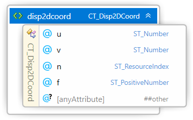
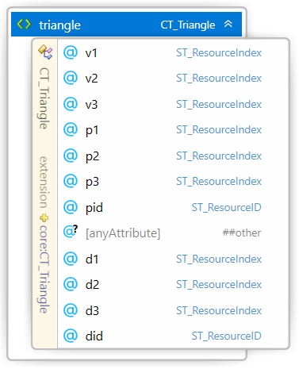

#
# 3MF Displacement Extension

## Specification & Reference Guide


| **Version** | 0.51 |
| --- | --- |
| **Status** | Draft |

## Table of Contents

- [Preface](#preface)
  * [About this Specification](#about-this-specification)
  * [Document Conventions](#document-conventions)
  * [Language Notes](#language-notes)
  * [Software Conformance](#software-conformance)
- [Part I: 3MF Documents](#part-i-3mf-documents)
  * [Chapter 1. Overview of Additions](#chapter-1-overview-of-additions)
  * [Chapter 2. Resources](#chapter-2-resources)
    + [2.1 Displacement2D](#21-displacement2d)
    + [2.2 Disp2DGroup](#22-disp2dgroup)
      - [2.2.1 Disp2DCoords](#221-disp2dcoords)
    + [2.3 NormVectorGroup](#23-normvectorgroup)
      - [2.3.1 NormVector](#231-normvector)
  * [Chapter 3. Mesh Triangles](#chapter-3-mesh-triangles)
	+ [3.1 Triangle](#31-triangle)
  * [Chapter 4. Usage rules](#chapter-4-usage-rules)
	+ [4.1 Fill Rule](#41-fill-rule)
	+ [4.2 Adjacent Triangles](#42-adjacent-triangles)
	+ [4.3 Displacement Map and Properties](#43-displacement-map-and-properties)
- [Part II. Appendixes](#part-ii-appendixes)
  * [Appendix A. Glossary](#appendix-a-glossary)
  * [Appendix B. 3MF XSD Schema](#appendix-b-3mf-xsd-schema)
  * [Appendix C. Standard Namespace](#appendix-c-standard-namespace)
  * [Appendix D: Example file](#appendix-d-example-file)
- [References](#references)


# Preface

## About this Specification

This 3MF displacement specification is an extension to the core 3MF specification. This document cannot stand alone and only applies as an addendum to the core 3MF specification. Usage of this and any other 3MF extensions follow an a la carte model, defined in the core 3MF specification.

Part I, "3MF Documents," presents the details of the primarily XML-based 3MF Document format. This section describes the XML markup that defines the composition of 3D documents and the appearance of each model within the document.

Part II, "Appendixes," contains additional technical details and schemas too extensive to include in the main body of the text as well as convenient reference information.

The information contained in this specification is subject to change. Every effort has been made to ensure its accuracy at the time of publication.

This extension MUST be used only with Core specification 1.x.

## Document Conventions

See [the 3MF Core Specification conventions](https://github.com/3MFConsortium/spec_core/blob/master/3MF%20Core%20Specification.md#document-conventions).

In this extension specification, as an example, the prefix "po" maps to the xml-namespace "http://schemas.hp.com/3dmanufacturing/partoptimization/2019/04". See Appendix [C.3 Namespaces](#c3-namespaces).

## Language Notes

See [the 3MF Core Specification language notes](https://github.com/3MFConsortium/spec_core/blob/master/3MF%20Core%20Specification.md#language-notes).

## Software Conformance

See [the 3MF Core Specification software conformance](https://github.com/3MFConsortium/spec_core/blob/master/3MF%20Core%20Specification.md#software-conformance).

# Part I: 3MF Documents

# Chapter 1. Overview of Additions

##### Figure 1-1: Encoding of an Initial sphere mesh (a), Encoding of a sphere mesh with a displacement map (b), Encoding of the retesselated sphere (c).

|  |  |  |
| :---: | :---: | :---: |
| Sphere mesh (27.500 triangles, 411kB). | Sphere mesh with greyscale displacement map (27.500 triangles, 1.2MB) | Retesselated Sphere mesh (660.000 triangles, 12.1MB)|

The rationale of the displacement specification extension is to enhance mesh geometry by a displacement mapping.
This is achieved displacing the 3D mesh geometry using a scalar map that describes the offset in the direction of the displacement vector.
This allows a very memory effective and accurate description of complex geometry.

This means that the displacement information of a triangle is given by
- UV coordinates for each corner
- A scalar 2D image for representing the "heightmap"
- A displacement direction for each corner which can be linearly interpolated on the surface

##### Figure 2-1: Example of displacement mapping from a texture.

|  |  |
| :---: | :---: |
| Triangle with interpolated and normalized displacement vectors | Texture referenced by triangle. The region referenced by the UV coordinates is highlighted. |

This document describes new elements, each of which is OPTIONAL for producers, but MUST be supported by consumers that specify support for this displacement extension of 3MF.

##### Figure 2-2: Overview of model resources XML structure of 3MF with displacement additions.

#####


##### Figure 2-3: Overview of model mesh XML structure of 3MF with displacement additions.

#####


# Chapter 2. Resources

## 2.1 Displacement2D
Element **\<displacement2d>**


| Name   | Type   | Use   | Default   | Annotation |
| --- | --- | --- | --- | --- |
| id | **ST\_ResourceID** | required |   | ResourceID of this displacement resource. |
| path | **ST\_UriReference** | required |   | path to the displacement texture. |
| contenttype | **ST\_ContentType** | required |   | Content type of the texture resource. PNG or JPEG allowed. |
| channel | **ST\_ChannelName** | optional | G | Specifies which channel to reference in the displacement texture. Valid values are R, G, B. Ignored for monochromatic images. |
| tilestyleu | **ST_TileStyle** |  | wrap | Specifies how tiling should occur in the u axis in order to fill the overall requested area. Valid values are wrap, mirror, clamp, none. |
| tilestylev | **ST_TileStyle** |  | wrap | Specifies how tiling should occur in the v axis in order to fill the overall requested area. Valid values are wrap, mirror, clamp, none. |
| filter | **ST_Filter** |  | auto | Specifies the texture filter to apply when scaling the source texture.  Allowed values are “auto”, “linear”, “nearest”. |
| @anyAttribute | | | | |

A displacement texture resource provides information about texture image data, found via the provided path reference, which MUST also be the target of a 3D Texture relationship from the 3D Model part. 

**contenttype** - The only supported content types are JPEG and PNG, as more specifically specified in the 3MF core spec under the [6.1. Thumbnail](https://github.com/3MFConsortium/spec_core/blob/master/3MF%20Core%20Specification.md#61-thumbnail) section.

**channel** - The channel attribute selects which of the RGB channels defines the displacement texture. 

If the specification says that a certain value is sampled from the texture’s R channel, but the referenced texture is only monochromatic, the grayscale channel MUST be used. Similarly, color values sampled from a monochromatic texture MUST be interpreted as if all R, G, B color channels shared the same grayscale value.

If the channel attribute is not specified, it defauls to the G-green channel for RGB images, or to the gray scale channel for monochromatic images.

The alpha channel that might be optionally specified in PNG images MUST be ignored for the displacement texture.

The displacement texture values range are independent from the image coding range, either 8-bit or 16-bit, and normalized to [0, 1] range. The normalized displacement values are obtained by dividing each channel by 2<sup>n</sup>-1, where n is the number of bits per channel. For example, in an 8-bit image the pixel values MUST be divided by 255.

**tilestyleu, tilestylev** - The tile style of "wrap" essentially means that the same displacement texture SHOULD be repeated in the specified axis (both in the positive and negative directions), for the axis value. The tile style of "mirror" means that each time the displacement texture width or height is exceeded, the next repetition of the texture SHOULD be reflected across a plane perpendicular to the axis in question. The tile style of "clamp" means all Displacement 2D Coordinates outside of the range zero to one will be assigned the displacement value of the nearest edge pixel. The tile style of "none" means that all Displacement 2D Coordinates outside the range zero to one will not have a displacement and stay on the triangle's surface.

**filter** - The producer MAY require the use of a specific filter type by specifying either “linear” for bilinear interpolation or “nearest” for nearest neighbor interpolation. The producer SHOULD use “auto” to indicate to the consumer to use the highest quality filter available. If the source texture is scaled with the model, the specified filter type MUST be applied to the scaling operation. The default value is “auto”.

## 2.2 Disp2DGroup
Element **\<disp2dgroup>**


| Name   | Type   | Use   | Default   | Annotation |
| --- | --- | --- | --- | --- |
| id | **ST\_ResourceID** | required |   | ResourceID of this Disp2dGroup resource |
| dispid | **ST\_ResourceID** | required |   | ID of the Displacement map used in this group |
| nid | **ST\_ResourceID** | | | ID of the normalized vector group used in this group |
| depth | **ST\_Number** | required |   | Scaling factor for the values in the displacement map |
| offset | **ST\_Number** |  |  0 | Offset after scaling the values in the displacement map |
| @anyAttribute | | | | |

A \<disp2dgroup> element acts as a container for texture coordinate properties. The order of these elements forms an implicit 0-based index that is referenced by other elements, such as the \<object> and \<triangle> elements. It also specifies which image to use, via dispid. The referenced \<displacement2d> elements are described above in [2.1 Displacement2D](#21-displacement2d).

**depth** - The depth attribute defines the displacement amplitude for the maximum texture value range.

**offset** - The offset attribute defines the displacement offset to apply. The offset default value is 0.

The displacement value is computed by:

	displacement value = (depth * displacement texture value) + offset

where the displacement texture value is in the range [0, 1], and the displacement value is applied in the model unit resolution, as specified in the 3MF core specification ([3.4 Model](https://github.com/3MFConsortium/spec_core/blob/master/3MF%20Core%20Specification.md#34-model)).

A positive displacement value specifies an outer extrusion of the original mesh and a negative displacement value especifies an inner extrusion of the original mesh.

To avoid integer overflows, a texture coordinate group MUST contain less than 2^31 disp2dcoords.

### 2.2.1 Disp2DCoords
Element **\<disp2dcoords>**



| Name   | Type   | Use   | Default   | Annotation |
| --- | --- | --- | --- | --- |
| u | **ST\_Number** | required |   | The u-coordinate within the texture, horizontally right from the origin in the lower left of the texture. |
| v | **ST\_Number** | required |   | The v-coordinate within the texture, vertically up from the origin in the lower left of the texture.|
| n | **ST\_ResourceIndex** | required |   | Index to the normalized displacement vector to apply to these coordinates |
| @anyAttribute | | | | |

Displacement coordinates map a vertex of a triangle to a position in image space (U, V coordinates). Displacement mapping allows high-resolution color bitmaps to be applied to any surface defining the offset in the range [0, 1] used to obtain the new geometry by the displacement of the surface triangle.

The lower left corner of the texture is the u, v coordinate (0,0), and the upper right coordinate is (1,1). The UV values are not restricted to this range. When the UV coordinates exceed the [0,1] range, the tilestyleu and tilestylev MUST be applied according to the tiling specified in [2.1 Displacement2D](#21-displacement2d).

## 2.3 NormVectorGroup
Element **\<normvectorgroup>**


| Name   | Type   | Use   | Default   | Annotation |
| --- | --- | --- | --- | --- |
| id | **ST\_ResourceID** | required |   | ResourceID of this NormVectorGroup resource |
| @anyAttribute | | | | |

A \<normvectorgroup> element acts as a container for normalized vectors properties. The order of these elements forms an implicit 0-based index that is referenced by the \<disp2dcoords> element.

To avoid integer overflows, a texture coordinate group MUST contain less than 2^31 disp2dcoords.

### 2.3.1 NormVector
Element **\<normvector>**


| Name   | Type   | Use   | Default   | Annotation |
| --- | --- | --- | --- | --- |
| nx | **ST\_Number** | required |   | X-component of the normalized displacement vector. |
| ny | **ST\_Number** | required |   | Y-component of the normalized displacement vector. |
| nz | **ST\_Number** | required |   | Z-component of the normalized displacement vector. |
| @anyAttribute | | | | |

The normalized vector defines the direction where the displacement is applied. The \<normvector> element MUST be normalized by the producer so the module of the displacement vector is 1.0. Consumers SHOULD accept non-normalized vectors but normalize them before applying.

The normalized vectors MUST point to the triangle's outer hemisphere where the displacement is applied.

Normalized vectors MUST be linearly interpolated to spread the displacement map along a surface. All interpolated vectors MUST be normalized before being applied. All interpolated normal vector MUST point to the outer hemisphere of the triangle.

The normalized displacement vector specifies the direction:

	displacement vector = normalized vector * displacement value,

# Chapter 3. Mesh triangles

The 3MF core specification ([4.1.4.1 Triangle](https://github.com/3MFConsortium/spec_core/blob/master/3MF%20Core%20Specification.md#4141-triangle)) represents a single face of the mesh, specifying the triangle vertices and the optional properties for each vertex. This specification extends the mesh triangle definition to specify the displacement map for the mesh triangles.

## 3.1 Triangle
Element **\<triangle>**



| Name   | Type   | Use   | Default   | Annotation |
| --- | --- | --- | --- | --- |
| d1 | **ST\_ResourceIndex** | | | Displacement map index for the first vertex of the triangle. |
| d2 | **ST\_ResourceIndex** | | | Displacement map index for the second vertex of the triangle. |
| d3 | **ST\_ResourceIndex** | | | Displacement map index for the third vertex of the triangle. |
| did | **ST\_ResourceID** | | | Displacement map id for the triangle. |
| @anyAttribute | | | | |

In addition to the \<triangle> element specified in the 3MF core specification ([4.1.4.1 Triangle](https://github.com/3MFConsortium/spec_core/blob/master/3MF%20Core%20Specification.md#4141-triangle)), the \<triangle> element is extended with the optional displacement map for each vertex.

The displacement map applied to each vertex (d1, d2, d3) allow displacement to be defined across the triangle by mapping to the displacement texture and the normalized displacement vector, where interpolation of the displacement normalized vector is defined as the linear convex combination and then normalized.

The displacement group is specified by the did attribute. Since this is applied to the whole triangle, it implicitly forces the three displacement map indices to be from the same group. If d1 is specified then the did attribute MUST be specified. If d2 or d3 is unspecified then d1 is used for the entire triangle. If d1 is unspecified then no displacement map is applied to the triangle.

Note: The displacement vectors, together with the triangle orientation, are affected by the sign of the determinant of the transformation as described in the 3MF core specification ([Section 4.1 Meshes](https://github.com/3MFConsortium/spec_core/blob/master/3MF%20Core%20Specification.md#41-meshes)).

# Chapter 4. Usage rules

There are a few rules for interpreting the displacement maps for obtaining the final shape: fill rule, adjacent triangles and triangle properties.

## 4.1 Fill Rule

When applying the displacement map to a mesh, the resultant shape might be outer extruded (enlarged), or inner extruded (shrunk). This shape change might result in shape self-intersections or new holes when two surfaces have an overlapping innner extrusion.

The final shape MUST be resolved by applying the Fill Rule as defined in the 3MF core specification ([4.1.1 Fill Rule](https://github.com/3MFConsortium/spec_core/blob/master/3MF%20Core%20Specification.md#411-fill-rule)).

For efficient displacment maps the producer SHOULD not generate self-intersecting displaced shapes, since this MAY cause overhead in the consumer.

## 4.2 Adjacent Triangles

When specifying the displacement on two adjacent triangles there MIGHT either be continuity or discontinuity in the join.

If the common vertices of two connected triangles, for each vertex, have a displacement map sharing the same NormVectorGroup and same NormVector entry, the consumer MUST preserve continuity, even if they have different UV mapping or Displacement2D textures. The continuity is preserved by connecting the displaced surfaces of both triangles.

Otherwise if any of the vertices do not share same NormVectorGrop and same NormVector index the consumer MUST preserve continuity by connecting each displaced surface through the triangle's shared edge.

##### Figure 4-1: shows a 2D view where the normalized displacement vectors of the vertices of a triangle are different from the normal of the corresponding triangle. The displacement vectors and the displacement values of each vertex belonging to two neighboring triangles are the same. The new displaced surfaces are connected continuosly.


##### Figure 4-2: shows a 2D view where the normalized displacement vectors of the vertices of a triangle are different from the normal of the corresponding triangle. The displacement vectors of each vertex belonging to two neighboring triangles are the same. The displacements described in the displacement map for the triangle at the top and the displacement for the triangle displayed on the right side are different. The new displaced surfaces are directly connected to close the new 3D shape using a flat surface (a line in the 2D view). The new displacement vector is indicated in Red, the section that needs to be filled in is indicated in Green.


##### Figure 4-3: shows a 2D view where the normalized displacement vectors of the vertices of a triangle are the same as the normal of the corresponding triangle. The displacement vectors of a vertex belonging to two neighboring triangles are different. The displacements described in the displacement map for the triangle at the top and the displacement for the triangle displayed on the right side are different. The new displaced surfaces are connected through the common edge in the mesh (common vertex in the 2D view diagram) to close the new 3D shape. This requires two flat surfaces (two lines in the 2D view) indicated in Green.


## 4.3 Displacement Map and Properties

The displacement map MIGHT be combined with another property, for example color, color textures, multiproperties, as defined in the [3MF Materials and Properties Extension](https://github.com/3MFConsortium/spec_materials/blob/master/3MF%20Materials%20Extension.md). When combined, the properties are first applied to the triangle and then the triangle with the properties MUST be displaced by the displacement map.

TBD: what color is obtained in the vertical surfaces generated by a sharp displacement?

# Part II. Appendixes

## Appendix A. Glossary

See [the 3MF Core Specification glossary](https://github.com/3MFConsortium/spec_core/blob/master/3MF%20Core%20Specification.md#appendix-a-glossary).

## Appendix B. 3MF XSD Schema

```xml
<?xml version="1.0" encoding="UTF-8"?> 
<xs:schema xmlns="http://schemas.microsoft.com/3dmanufacturing/displacement/2018/05" xmlns:xs="http://www.w3.org/2001/XMLSchema" xmlns:xml="http://www.w3.org/XML/1998/namespace" targetNamespace="http://schemas.microsoft.com/3dmanufacturing/displacement/2018/05" 
elementFormDefault="unqualified" attributeFormDefault="unqualified" blockDefault="#all">
	<xs:import namespace="http://www.w3.org/XML/1998/namespace" schemaLocation="http://www.w3.org/2001/xml.xsd"/>
	<xs:annotation> 
		<xs:documentation><![CDATA[   Schema notes: 
 
  Items within this schema follow a simple naming convention of appending a prefix indicating the type of element for references: 
 
  Unprefixed: Element names 
  CT_: Complex types 
  ST_: Simple types 
   
  ]]></xs:documentation> 
	</xs:annotation> 
	
	<!-- Complex Types --> 
	<xs:complexType name="CT_Resources"> 
		<xs:sequence>
			<xs:choice minOccurs="0" maxOccurs="2147483647">
				<xs:element ref="displacement2d" minOccurs="0" maxOccurs="2147483647"/>
				<xs:element ref="normvectorgroup" minOccurs="0" maxOccurs="2147483647"/>
				<xs:element ref="disp2dgroup" minOccurs="0" maxOccurs="2147483647"/>
				<xs:any namespace="##other" processContents="lax" minOccurs="0"
					maxOccurs="2147483647"/>
			</xs:choice>
		</xs:sequence>
		<xs:anyAttribute namespace="##other" processContents="lax"/> 
	</xs:complexType>
	
	<xs:complexType name="CT_Displacement2D">   
		<xs:attribute name="id" type="ST_ResourceID" use="required"/>
		<xs:attribute name="path" type="ST_UriReference" use="required" />
		<xs:attribute name="contenttype" type="ST_ContentType" use="required"/>
		<xs:attribute name="channel" type="ST_ChannelName" default="G"/>
		<xs:attribute name="tilestyleu" type="ST_TileStyle" default="wrap"/>
		<xs:attribute name="tilestylev" type="ST_TileStyle" default="wrap"/>
		<xs:attribute name="filter" type="ST_Filter" default="auto"/>
		<xs:anyAttribute namespace="##other" processContents="lax"/> 
	</xs:complexType>
	
	<xs:complexType name="CT_Disp2DGroup">
		<xs:sequence>
			<xs:element ref="disp2dcoord" minOccurs="1" maxOccurs="2147483647"/>
			<xs:any namespace="##other" processContents="lax" minOccurs="0" maxOccurs="2147483647"/>
		</xs:sequence>
		<xs:attribute name="id" type="ST_ResourceID" use="required"/>
		<xs:attribute name="dispid" type="ST_ResourceID" use="required"/>
		<xs:attribute name="depth" type="ST_Number" use="required"/>
		<xs:attribute name="offset" type="ST_Number" default="0"/>
		<xs:anyAttribute namespace="##other" processContents="lax"/> 
	</xs:complexType>
	
	<xs:complexType name="CT_NormalizedVectorGroup">
		<xs:sequence>
			<xs:element ref="normvector" minOccurs="1" maxOccurs="2147483647"/>
			<xs:any namespace="##other" processContents="lax" minOccurs="0" maxOccurs="2147483647"/>
		</xs:sequence>
		<xs:attribute name="id" type="ST_ResourceID"  use="required"/>
		<xs:anyAttribute namespace="##other" processContents="lax"/> 
	</xs:complexType>
	
	<xs:complexType name="CT_NormalizedVector">
		<xs:attribute name="nx" type="ST_Number" use="required"/>
		<xs:attribute name="ny" type="ST_Number" use="required"/>
		<xs:attribute name="nz" type="ST_Number" use="required"/>
		<xs:anyAttribute namespace="##other" processContents="lax"/> 
	</xs:complexType>
	
	<xs:complexType name="CT_Disp2DCoord">
		<xs:attribute name="u" type="ST_Number" use="required"/>
		<xs:attribute name="v" type="ST_Number" use="required"/>
		<xs:attribute name="n" type="ST_ResourceIndex" use="required"/>
		<xs:attribute name="nid" type="ST_ResourceID" use="required"/>
		<xs:anyAttribute namespace="##other" processContents="lax"/> 
	</xs:complexType>
	
	<xs:complexType name="CT_Triangle">
		<xs:attribute name="d1" type="ST_ResourceIndex"/>
		<xs:attribute name="d2" type="ST_ResourceIndex"/>
		<xs:attribute name="d3" type="ST_ResourceIndex"/>
		<xs:attribute name="did" type="ST_ResourceID"/>
		<xs:anyAttribute namespace="##other" processContents="lax"/>
	</xs:complexType>
	
	<!-- Simple Types -->
	<xs:simpleType name="ST_ContentType">
		<xs:restriction base="xs:string">
			<xs:enumeration value="image/jpeg"/>
			<xs:enumeration value="image/png"/>
		</xs:restriction>
	</xs:simpleType>
	<xs:simpleType name="ST_ChannelName">
		<xs:restriction base="xs:string">
			<xs:enumeration value="R"/>
			<xs:enumeration value="G"/>
			<xs:enumeration value="B"/>
		</xs:restriction>
	</xs:simpleType>
	<xs:simpleType name="ST_TileStyle">
		<xs:restriction base="xs:string">
			<xs:enumeration value="clamp"/>
			<xs:enumeration value="wrap"/>
			<xs:enumeration value="mirror"/>
			<xs:enumeration value="none"/>
		</xs:restriction>
	</xs:simpleType>
	<xs:simpleType name="ST_Filter">
		<xs:restriction base="xs:string">
			<xs:enumeration value="auto"/>
			<xs:enumeration value="linear"/>
			<xs:enumeration value="nearest"/>
		</xs:restriction>
	</xs:simpleType>
	<xs:simpleType name="ST_UriReference"> 
		<xs:restriction base="xs:anyURI"> 
			<xs:pattern value="/.*"/> 
		</xs:restriction> 
	</xs:simpleType> 
	<xs:simpleType name="ST_Number"> 
		<xs:restriction base="xs:double"> 
			<xs:whiteSpace value="collapse"/> 
			<xs:pattern value="((\-|\+)?(([0-9]+(\.[0-9]+)?)|(\.[0-9]+))((e|E)(\-|\+)?[0-9]+)?)"/> 
		</xs:restriction> 
	</xs:simpleType> 
	<xs:simpleType name="ST_ResourceID">
		<xs:restriction base="xs:positiveInteger">
			<xs:maxExclusive value="2147483648"/>
		</xs:restriction>
	</xs:simpleType>

	<xs:simpleType name="ST_ResourceIndex">
		<xs:restriction base="xs:nonNegativeInteger">
			<xs:maxExclusive value="2147483648"/>
		</xs:restriction>
	</xs:simpleType>
	
	<!-- Elements -->
	<xs:element name="resources" type="CT_Resources"/>
	<xs:element name="displacement2d" type="CT_Displacement2D"/>
	<xs:element name="normvectorgroup" type="CT_NormalizedVectorGroup"/>
	<xs:element name="normvector" type="CT_NormalizedVector"/>
	<xs:element name="disp2dgroup" type="CT_Disp2DGroup"/>	
	<xs:element name="disp2dcoord" type="CT_Disp2DCoord"/>
	<xs:element name="triangle" type="CT_Triangle"/>
</xs:schema> 
```

# Appendix C. Standard Namespace

| | |
| --- | --- |
|Displacement | [http://schemas.microsoft.com/3dmanufacturing/displacement/2018/05](http://schemas.microsoft.com/3dmanufacturing/displacement/2018/05) |

# Appendix D: Example file

## 3D model
```xml
<?xml version="1.0" encoding="UTF-8"?>
<model unit="millimeter" xml:lang="en-US" xmlns:d="http://schemas.microsoft.com/3dmanufacturing/displacement/2018/05" xmlns="http://schemas.microsoft.com/3dmanufacturing/core/2015/02">
  <metadata name="CreationDate">2013-10-07</metadata>
  <metadata name="Copyright">© Microsoft Corporation 2013</metadata>
  <metadata name="Designer">Microsoft Corporation</metadata>
  <metadata name="ChangeHistory">2013-10-07 Initial model</metadata>
  <metadata name="Title">Cube</metadata>
  <metadata name="ModificationDate">2014-03-27</metadata>
  <metadata name="LicenseTerms">All rights reserved</metadata>
  <metadata name="Description">Cube</metadata>
  <resources>
    <d:displacement2d id="3" path="/3D/Texture/paperbag_mono.png" contenttype="image/png" tilestyleu="wrap" tilestylev="wrap" />
    <d:normvectorgroup id="8" >
      <d:normvector nx="0" ny="-1" nz="0" />
      <d:normvector nx="0" ny="0" nz="1" />
      <d:normvector nx="0" ny="-0.707" nz="0.707" />
    </d:normvectorgroup>
    <d:disp2dgroup id="7" dispid="3" depth="1.5" >
      <d:disp2coord u="0" v="1" nid="8" n="0" />
      <d:disp2coord u="1" v="1" nid="8" n="0" />
      <d:disp2coord u="0" v="0" nid="8" n="0" />
      <d:disp2coord u="1" v="0" nid="8" n="0" />
      <d:disp2coord u="0" v="2" nid="8" n="1" />
      <d:disp2coord u="1" v="2" nid="8" n="1" />
      <d:disp2coord u="0" v="2" nid="8" n="1" />
      <d:disp2coord u="0" v="1" nid="8" n="2" />
      <d:disp2coord u="1" v="1" nid="8" n="2" />
    </d:disp2dgroup>
    <object id="4" type="model">
      <mesh>
        <vertices>
          <vertex x="0" y="42.998" z="39.998" />
          <vertex x="39.998" y="42.998" z="39.998" />
          <vertex x="0" y="82.998" z="39.998" />
          <vertex x="39.998" y="82.998" z="0" />
          <vertex x="0" y="42.998" z="0" />
          <vertex x="0" y="82.998" z="0" />
          <vertex x="39.998" y="42.998" z="0" />
          <vertex x="39.998" y="82.998" z="39.998" />
        </vertices>
        <triangles>
          <triangle v1="0" v2="1" v3="2" d:did="7" d:d1="7'" d:d2="8" d:d3="4" />
          <triangle v1="3" v2="4" v3="5" />
          <triangle v1="4" v2="3" v3="6" />
          <triangle v1="7" v2="2" v3="1" d:did="7" d:d1="5" d:d2="6" d:d3="1" />
          <triangle v1="4" v2="6" v3="1" d:did="7" d:d1="2" d:d2="3" d:d3="1" />
          <triangle v1="4" v2="2" v3="5" />
          <triangle v1="7" v2="1" v3="6" />
          <triangle v1="5" v2="2" v3="7" />
          <triangle v1="4" v2="0" v3="2" />
          <triangle v1="6" v2="3" v3="7" />
          <triangle v1="1" v2="0" v3="4" d:did="7" d:d1="8" d:d2="7'" d:d3="2" />
          <triangle v1="7" v2="3" v3="5" />
        </triangles>
      </mesh>
    </object>
    <object id="5" type="model">
      <components>
        <component objectid="4" />
      </components>
    </object>
  </resources>
  <build>
    <item objectid="5" transform="0.999996 0 0 -9.93535e-007 0.999996 -9.02387e-014 1.79176e-006 -7.59051e-007 0.999999 -19.8624 -61.5909 -3.21579" />
  </build>
</model>
```

# References

**BNF of Generic URI Syntax**

"BNF of Generic URI Syntax." World Wide Web Consortium. http://www.w3.org/Addressing/URL/5\_URI\_BNF.html

**Open Packaging Conventions**

Ecma International. "Office Open XML Part 2: Open Packaging Conventions." 2006. http://www.ecma-international.org

**sRGB**

Anderson, Matthew, Srinivasan Chandrasekar, Ricardo Motta, and Michael Stokes. "A Standard Default Color Space for the Internet-sRGB, Version 1.10." World Wide Web Consortium. 1996. http://www.w3.org/Graphics/Color/sRGB

**Unicode**

The Unicode Consortium. The Unicode Standard, Version 4.0.0, defined by: _The Unicode Standard, Version 4.0_. Boston, MA: Addison-Wesley, 2003.

**XML**

Bray, Tim, Eve Maler, Jean Paoli, C. M. Sperlberg-McQueen, and François Yergeau (editors). "Extensible Markup Language (XML) 1.0 (Fourth Edition)." World Wide Web Consortium. 2006. http://www.w3.org/TR/2006/REC-xml-20060816/

XML C14N

Boyer, John. "Canonical XML Version 1.0." World Wide Web Consortium. 2001. http://www.w3.org/TR/xml-c14n.

XML Namespaces

Bray, Tim, Dave Hollander, Andrew Layman, and Richard Tobin (editors). "Namespaces in XML 1.0 (Second Edition)." World Wide Web Consortium. 2006. http://www.w3.org/TR/2006/REC-xml-names-20060816/

XML Schema

Beech, David, Murray Maloney, Noah Mendelsohn, and Henry S. Thompson (editors). "XML Schema Part 1: Structures," Second Edition. World Wide Web Consortium. 2004. http://www.w3.org/TR/2004/REC-xmlschema-1-20041028/

Biron, Paul V. and Ashok Malhotra (editors). "XML Schema Part 2: Datatypes," Second Edition. World Wide Web Consortium. 2004. http://www.w3.org/TR/2004/REC-xmlschema-2-20041028/
